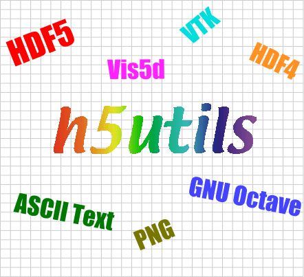

# H5utils

**h5utils** is a set of utilities for visualization and conversion of scientific data in the free, portable [HDF5 format](http://www.hdfgroup.org/HDF5/).

Besides providing a simple tool for batch visualization as [PNG](https://en.wikipedia.org/wiki/Portable_Network_Graphics) images, h5utils also includes programs to convert HDF5 datasets into the formats required by other free visualization software (e.g. plain text, [Vis5d](http://www.ssec.wisc.edu/~billh/vis5d.html), and [VTK](http://public.kitware.com/VTK/)).

This package is developed by [Steven G. Johnson](http://math.mit.edu/~stevenj/), and is [free software](http://www.gnu.org/philosophy/free-sw.html) that should easily install under any Unix-like operating system (*e.g.* GNU/Linux).

# Download and Install

The latest version is h5utils 1.12.1, which can be downloaded in source-code form at:

* http://ab-initio.mit.edu/h5utils/h5utils-1.12.1.tar.gz

What's new in each version is described in the [release notes](NEWS.md) file.

h5utils is free software (a.k.a. [open source](http://www.opensource.org/)); see below for the license and copyright.

## Installation

h5utils is designed for Unix-like operating systems (*e.g.* GNU/Linux). We do not support Windows directly, although you may be able to install there too using free packages like [Cygwin](http://cygwin.com/).

You must first download and install [HDF5](http://www.hdfgroup.org/HDF5/), if it is not already on your system. Also, the programs to convert (see below) to/from [PNG](http://www.libpng.org/pub/png/), [Vis5d](http://www.ssec.wisc.edu/~billh/vis5d.html), [GNU Octave](http://www.octave.org/), and [HDF(4)](http://www.hdfgroup.org/products/hdf4/) will only be built if the corresponding libraries/programs are installed. `h5math` will only be built if [GNU libmatheval](http://www.gnu.org/software/libmatheval/) is installed.

To compile and install the package, you then just type the usual GNU build commands:
```
./configure
make
make install
```
See `./configure --help` for more options. You can use `make uninstall` to get rid of all the installed files.

**Github**: If you are using the source [on github](https://github.com/stevengj/h5utils) (via `git clone https://github.com/stevengj/h5utils`), then you will also need to have [GNU autoconf, automake, and libtool](https://en.wikipedia.org/wiki/GNU_Build_System) installed, and run `sh autoconf.sh` (in a Unix shell) to set up things before running `make` above.

**Note:** if you get a message like `cannot compute sizeof (unsigned long)` when running `./configure`, it probably means you didn't install the HDF5 library properly: you need to tell the runtime linker where to find it. On GNU/Linux, make sure there is a line `/usr/local/lib` in `/etc/ld.so.conf` and run `/sbin/ldconfig` (assuming you installed HDF5 in the default location).

*Note:* if you installed the [MPI](https://en.wikipedia.org/wiki/Message_Passing_Interface) (parallel) version of HDF5, you may get an error like `/usr/include/H5public.h:53:20: error: mpi.h: No such file or directory`.  This can be fixed by telling the compiler where to find the MPI header files, e.g. via: `./configure CC=mpicc`.

# h5utils Programs

The included utilities are:

* **h5totxt** and **h5fromtxt**: convert HDF5 datasets to/from ASCII text (e.g. comma- or tab-delimited). See the man pages of [h5totxt](http://ab-initio.mit.edu/h5utils/h5totxt-man.html) and [h5fromtxt](http://ab-initio.mit.edu/h5utils/h5fromtxt-man.html) for more information.
* **h5topng**: convert 2d slices of HDF5 datasets to PNG images, with a variety of color tables and other options. See the [h5topng man page](http://ab-initio.mit.edu/h5utils/h5topng-man.html) for more information.   See [Color tables in h5topng](doc/h5topng-colors.md) for information on the color tables.
* **h5tov5d**: convert HDF5 datasets to the format used by the free 3d+ visualization tool [Vis5d](http://www.ssec.wisc.edu/~billh/vis5d.html). See the [man page](http://ab-initio.mit.edu/h5utils/h5tov5d-man.html) for more information.  **Note**: to install h5tov5d you must have first compiled Vis5d, and you must specify `--with-v5d=dir` to the h5utils `configure` script to specify the location `dir` of the Vis5d source directory.
* **h5tovtk**: convert HDF5 datasets to VTK format for use by the free [Visualization ToolKit](http://public.kitware.com/VTK/) (along with supporting programs like [MayaVi](http://mayavi.sourceforge.net/)). See the [man page](http://ab-initio.mit.edu/h5utils/h5tovtk-man.html) for more information.
* **h5math**: create and combine HDF5 datasets with simple (pointwise) mathematical expressions. (Requires [GNU libmatheval](http://www.gnu.org/software/libmatheval/) to be installed.) See the [man page](http://ab-initio.mit.edu/h5utils/h5math-man.html) for more information.
* **h5read.oct**: a plug-in for [GNU Octave](http://www.octave.org/) (a Matlab-like program) to read 2d slices of HDF5 datasets. (Recent versions of Octave also include native support for HDF5, although it can't read slices like the `h5read` plug-in.)
* **h5fromh4* and *h4fromh5**: convert HDF (version 4) datasets to and from HDF5. These utilities are nowadays somewhat redundant with the [h4toh5](http://hdfgroup.com/h4toh5/) and `h5toh4` programs provided by NCSA and the HDF Group (which are no longer bundled with HDF5, however). See the [h5fromh4](http://ab-initio.mit.edu/h5utils/h5fromh4-man.html) and [h4fromh5](http://ab-initio.mit.edu/h5utils/h4fromh5-man.html) man pages for more information.

To convert HDF5 to [CDF](http://nssdc.gsfc.nasa.gov/cdf/cdf_home.html) format, see the [hdf5-to-cdf](http://nssdc.gsfc.nasa.gov/cdf/html/FAQ.html#hdf5tocdf) program.

# License and Copyright

h5utils is Copyright © 1999–2017 Massachusetts Institute of Technology.

*The following [MIT/expat license](https://opensource.org/licenses/MIT) governs the entire contents of h5utils except for the `h5tov5d.c` file. See below.*

> Permission is hereby granted, free of charge, to any person obtaining a copy of this software and associated documentation files (the "Software"), to deal in the Software without restriction, including without limitation the rights to use, copy, modify, merge, publish, distribute, sublicense, and/or sell copies of the Software, and to permit persons to whom the Software is furnished to do so, subject to the following conditions:
>
>The above copyright notice and this permission notice shall be included in all copies or substantial portions of the Software.
>
>THE SOFTWARE IS PROVIDED "AS IS", WITHOUT WARRANTY OF ANY KIND, EXPRESS OR IMPLIED, INCLUDING BUT NOT LIMITED TO THE WARRANTIES OF MERCHANTABILITY, FITNESS FOR A PARTICULAR PURPOSE AND NONINFRINGEMENT. IN NO EVENT SHALL THE AUTHORS OR COPYRIGHT HOLDERS BE LIABLE FOR ANY CLAIM, DAMAGES OR OTHER LIABILITY, WHETHER IN AN ACTION OF CONTRACT, TORT OR OTHERWISE, ARISING FROM, OUT OF OR IN CONNECTION WITH THE SOFTWARE OR THE USE OR OTHER DEALINGS IN THE SOFTWARE.

*The file `h5tov5d.c` and the resulting `h5tov5d` binary are under the following different license, the [GNU GPL](http://www.gnu.org/copyleft/gpl.html) since they link with files from the GPL-covered Vis5d:*

>This program is free software; you can redistribute it and/or modify it under the terms of the GNU General Public License as published by the Free Software Foundation; either version 2 of the License, or (at your option) any later version.
>
>This program is distributed in the hope that it will be useful, but WITHOUT ANY WARRANTY; without even the implied warranty of MERCHANTABILITY or FITNESS FOR A PARTICULAR PURPOSE. See the GNU General Public License for more details.
>
>You should have received a copy of the GNU General Public License along with this program; if not, write to the Free Software Foundation, Inc., 59 Temple Place, Suite 330, Boston, MA 02111-1307 USA. You can also find it on the GNU web site: http://www.gnu.org/copyleft/gpl.html
