# Color tables in h5topng

The `h5topng` utility program contains a number of built-in color tables that you can use for plotting data.  These color tables are listed below, in some cases with notes about where they came from or suggested usage.

## Color tables
The color scales that I would tend to recommend are the following five, taken from [the Matplotlib colormaps](https://matplotlib.org/users/colormaps.html):

* `viridis`: 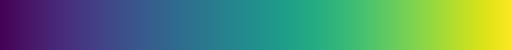
 - the default blue-green-yellow colormap in Matplotlib, a nice sequential colormap
* `RdBu`: 
 - red-white-blue colormap, good for signed data in conjunction with `-Z` option to make white=0
* `inferno`: 
  - a black-purple-red-orange-yellow colormap, a good replacement for the old `hot` colormap
 * `BrBg`: 
  - brown-white-aquamarine colormap, an alternative to `RdBu` for signed data, also best used in conjunction with the `-Z` option to make white=0

These two are also sometimes useful:

* `gray`:  
 - simple black-to-white grayscale color bar
* `yarg`: 
 - simple white-to-black grayscale color bar (the reverse of `gray`, and almost equivalent to using `-gray` or `gray` with `-r`); this is useful to make contour-like overlays with the `-A` option because its transparency scale (black is transparent) is the opposite of `gray` (white is transparent)

For a long time, I used the following color maps, but nowadays they are somewhat old-fashioned because they aren't "perceptually uniform".  See [this wonderful talk on designing colormaps](https://www.youtube.com/watch?v=xAoljeRJ3lU) for what goes into designing a modern colormap:

* `bluered`: 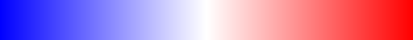
 - blue-white-red colorbar, useful for signed data in conjunction with `-Z` option to make white=0
* `dkbluered`: 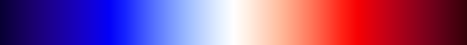
 - dark blue-white-red colorbar, useful for signed data in conjunction with `-Z` option to make white=0; similar to `bluered` but shows a bit more dynamic range for the maxima/minima by darkening at the ends
* `hot`: 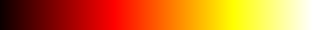
 - black-red-yellow-white color map, useful for nonnegative "intensity" data &mdash; based on [colormap](http://www.mathworks.com/access/helpdesk/help/techdoc/ref/colormap.shtml) of the same name in Matlab, loosely resembling the color of heated object at increasing temperatures

The remaining color scales, mostly based on the corresponding [colormaps(http://www.mathworks.com/access/helpdesk/help/techdoc/ref/colormap.shtml) of the same name in Matlab, are:

* `autumn`: 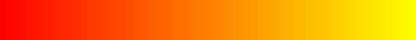
 - red-orange-yellow color map
* `bone`: 
 - nearly grayscale (blackish to whitish) color map with a tinge of blue
* `colorcube`: 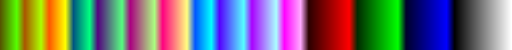
 - enhanced color-cube color map, basically designed to fill the RGB color space with an emphasis on a few pure colors
* `cool`: 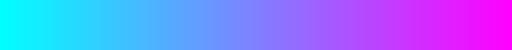
 - cyan-magenta color map
* `copper`: 
 - black-copper color map
* `flag`: 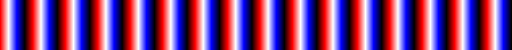
 - alternating red/white/blue/black color map
* `green`: 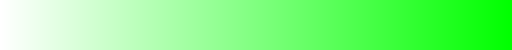
 - white-green color map; useful for translucent overlays with `-A`
* `hsv`: 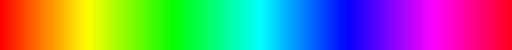
 - red-yellow-green-cyan-blue-pink-magenta color map formed by changing the hue component in the HSV color space
* `jet`: 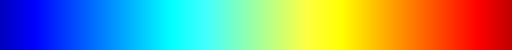
 - blue-cyan-yellow-red color map (a variant of `hsv`)
* `lines`: 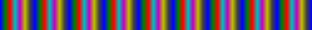
 - oscillating color map
* `pink`: 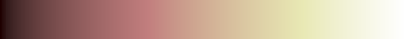
 - pastel black-pink-white color map, used for Sepia tone colorization
* `prism`: 
 - repeating red-yellow-green-blue-purple-...-green color map
* `spring`: 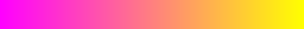
 - magenta-yellow color map
* `summer`: 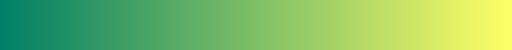
 - green-yellow color map
* `vga`: 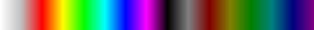
 - Windows 4-bit color map
* `winter`: 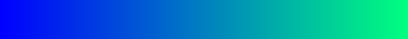
 - blue-green color map
* `yellow`: 
 - white-yellow color map; useful for translucent overlays with `-A`

## Defining your own color scale

You can also make your own color scales.  The are specified in `h5topng` by a simple text file of numbers: each line should contain four whitespace-separated numbers from 0 to 1, each indicating an [RGBA](https://en.wikipedia.org/wiki/RGBA_color_space) value (red,green, blue, and alpha/transparency).  For example, the `bluered` color table is defined by the following text:
```
0 0 1   1
1 1 1   0
1 0 0   1
```
The first line is blue (0,0,1) and opaque (1), the second line is white (1,1,1) and transparent (0), and the third line is red (1,0,0) and opaque (1).  The opacity values are currently only used in `h5topng` for transparent overlays with the `-A` option.

`h5topng` linearly interpolates in the table of RGBA values you provide in order to assign colors for arbitrary intermediate values (where the first line = minimum and the last line = maximum).

Just save your color scale in a text file, and specify the text file pathname to the `-c` option.

## Using the color tables in `h5topng`

To use a given color table in h5topng, simply use the `-c` option.  For example, to use the `hot` color table, you might do:
```
h5topng -c hot foobar.h5
```
To apply the `bluered` or `dkbluered` tables to signed (positive and negative) data, you usually want to "center" the color table so that the middle (white) corresponds to zero data.  You can do this with the `-Z` option, as in:
```
h5topng -Zc bluered foobar.h5
```
By default, `h5topng` scales the color table so that the ends correspond to the minimum and maximum of the data.  (In the case of `-Z`, the data is centered so that one end of the color table corresponds to the maximum magnitude.)  However, in some cases you want to "saturate" the color table to emphasize small values, so that all values above some maximum (or below some minimum) are simply assigned to the maximum (or minimum) color in the table.  You can do this using the `-M` (or `-m`) option(s).  For example, to set the minimum at 0 and the maximum at 0.0001, you might do:
```
h5topng -m 0 -M 0.0001 -c hot foobar.h5
```
Another useful option is `-r`, which reverses the order of the color table (e.g. to make blue positive and red negative).

See [the Unix man page for h5topng](http://ab-initio.mit.edu/h5utils/h5topng-man.html) for more information.

# Making a colorbar image

If you want to use the `h5topng` plot in a publication, often you will want to give a colorbar showing the scale of values. `h5topng` itself does not add axis labels or colorbars, but you can put these together in an external drawing program like [Inkscape](https://en.wikipedia.org/wiki/Inkscape).  To create a PNG image of the color scale, a simple trick is the following:
```
echo "0 1" | h5fromtxt colorbar.h5
h5topng -c hot -X 256 -Y 50 colorbar.h5
```
The first command creates an HDF5 file with the numbers 0 and 1 using the [h5fromtxt](http://ab-initio.mit.edu/h5utils/h5totxt-man.html) utility, and the second creates a 256×50 image of the color scale (here for `hot`).  You can, of course, resize the image or change color scales as needed.

(This was already done to create all of the colorbar images in the table above, which you are free to use, redistribute, and modify as desired.)

You will have to manually label the minimum and maximum values when you import the color scale into your drawing program.  If you don't know these values, you can make `h5topng` print them out by passing the `-v` (verbose) option when generating the image from your data.
